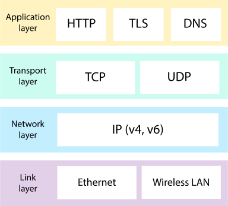
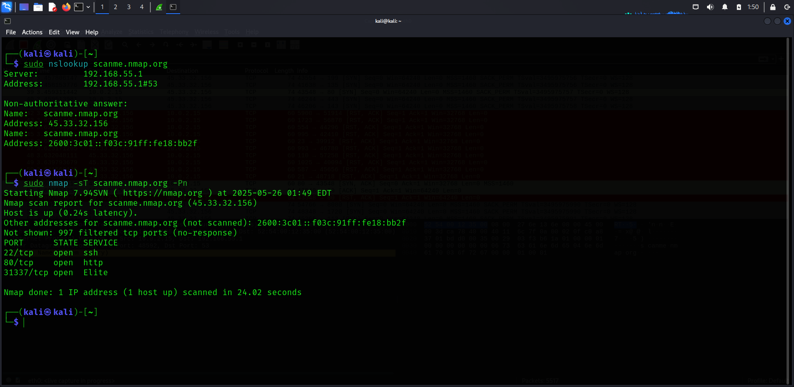

# upgraded-barnacle
This paper explores the TCP/IP protocol suite, focusing on TCP's three-way handshake that establishes a reliable connection. The handshake—SYN, SYN-ACK, and ACK—synchronizes devices for data transfer. Understanding this process and TCP/IP’s layered structure is essential for analyzing network communication and reliability.

   

Overview:
 This repository contains research materials, documentation, and code samples related to the Transmission Control Protocol (TCP) and the TCP/IP protocol suite. The focus is on understanding how TCP establishes reliable, ordered, and error-checked communication through its three-way handshake process, and how TCP fits within the layered architecture of the TCP/IP model that powers modern network communication.

Key Concepts:
 TCP Three-Way Handshake: This fundamental mechanism involves three steps—SYN, SYN-ACK, and ACK packets—that synchronize both communicating devices before initiating data transfer. It ensures connection reliability by agreeing on initial sequence numbers and communication parameters.

TCP/IP Protocol Suite: A comprehensive set of protocols that govern network communications, where TCP provides connection-oriented, reliable data transmission atop the Internet Protocol (IP), which handles routing and addressing of packets across diverse networks.

   

Purpose:
 The repository serves as a resource for researchers, students, and network engineers aiming to deepen their understanding of:

How TCP guarantees reliable connections through handshake protocols

The interaction between TCP and IP in the TCP/IP suite

The impact of TCP/IP architecture on network performance and reliability

The security implication of tcp protocol

Contents:
 Research papers and articles explaining TCP handshake and TCP/IP protocols

Code examples demonstrating TCP connection establishment and data transfer

Diagrams illustrating the three-way handshake process with the help of nmap and wireshark

Performance analysis related to TCP connection setup

SYN-Flood Attack of TCP protocol

Usage
This repository can be used as a reference for academic research, network protocol development, or educational purposes. Users can review the provided materials to better understand TCP/IP fundamentals, experiment with code examples, and apply insights to related networking projects.
